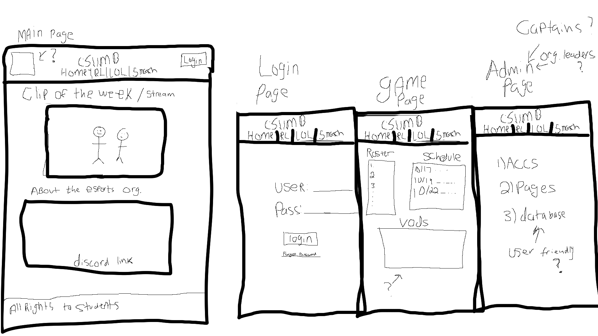

## Team Members
[Garrett Shrop](https://github.com/GarrettShrop) <br/>
[Joseph Newman](https://github.com/Joseph-M-Newman)<br/>

## Description
This website is designed and built to help assist the Esports organization in keeping track of all sub-category games hosted by CSUMB esports. 

The website will display information on the organization, the team rosters, vods, clips, and much more.

The games that are/will be supported as of 11/5/2021 are the following: 
```
Rocket League
League of Legends
Valorant
Call of Duty
Smash Brothers
Apex Legends
```

# Mockup 
**This is a rough mockup of a website designed by Garrett and Joseph. All rights belong to them and them only.**

ERD and Flowchat soon to follow

